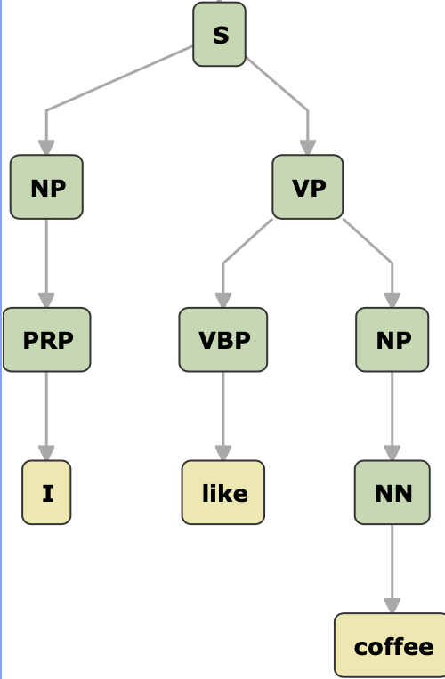

# Question Form

## 1. Natural Language Processing

1. Explain *distributional hypothesis* and its connection to word2vec
2. Given a training corpus with 10K vocab, what are the perplexity lower and upper bounds of a language model trainined on this corpus?
3. In a POS tagging task, if the sentence length is $N$ and the number of candidate tags is $K$, then what is the computational complexity of the Viterbi decoding algorithm?
4. Discribe the shift-reduce parsing procedure that produces the following constituency parse of the sentence *I like coffee* 

## 2. Statistical Machine Learning

1. What are the purposes of using a development set in training?
2. How to justify a machine learning overfits training data? How L2 regularization can help avoid overfitting?
3. Explain the bias and variance tradeoff in a regression case?

## 3. Deep learning

1. Within the framework of RNNs, explain the gradient exploding problem during training. What is the simple solution to this problem?
2. Explain the idea of dropout in learning neural networks and its connection to ensemble learning.

## 4. Information theory

1. For a given distribution $p$, how to define its entropy? What are the entropy lower and upper bounds of a binary random variable? 
2. Given two distributions $p$ and $q$ over the same sample space, how to define the Kullback–Leibler divergence $D_{KL}(q\|p)$? Under what condition, $D_{KL}(q\|p)=0$?